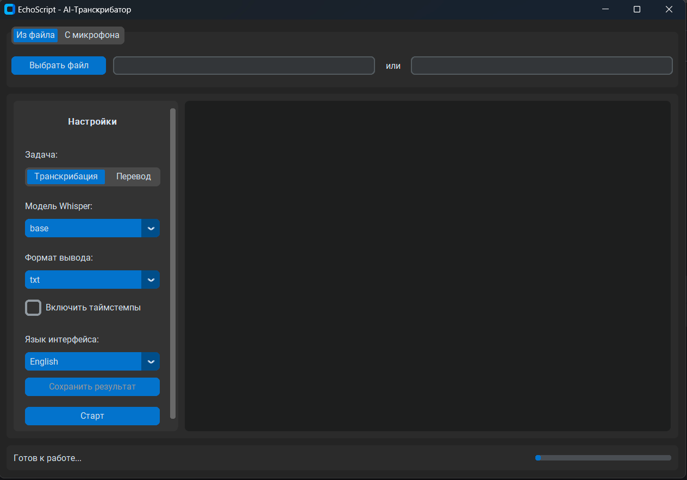

# EchoScript 🎙️ — AI-Транскрибатор Медиафайлов

**EchoScript** — это современное кросс-платформенное десктопное приложение, которое использует мощь модели OpenAI Whisper для высокоточной автоматической транскрибации аудио- и видеофайлов, а также контента с YouTube. Проект разработан с акцентом на чистую архитектуру, производительность и удобство для конечного пользователя.



---

## 🌟 Ключевые возможности

*   **Универсальность источников:**
    *   **Локальные файлы:** Транскрибируйте любые аудио- (`.mp3`, `.wav`, `.m4a`) и видеофайлы (`.mp4`, `.mov`).
    *   **YouTube:** Просто вставьте URL, чтобы получить текстовую версию любого видео.
*   **Гибкие настройки:**
    *   **Выбор модели Whisper:** От `tiny` для быстрой обработки до `large` для максимальной точности.
    *   **Поддержка таймстемпов:** Включайте временные метки для удобной навигации по тексту.
    *   **Разные форматы экспорта:** Сохраняйте результат в `.txt` или `.md`.
*   **Продуманный пользовательский опыт:**
    *   **Интуитивный GUI:** Современный и понятный интерфейс, созданный с помощью CustomTkinter.
    *   **Отзывчивость:** Интерфейс никогда не "зависает" благодаря многопоточной архитектуре.
    *   **Наглядная обратная связь:** Прогресс-бары и статусные сообщения информируют пользователя на каждом этапе.
    *   **Быстрый запуск:** Приложение открывается за ~7 секунд благодаря технике отложенной загрузки "тяжелых" AI-моделей.
*   **Кросс-платформенность:**
    *   Приложение упаковано с помощью PyInstaller и готово к работе на Windows. Архитектура позволяет легко собрать его для macOS и Linux.

---

## 🏛️ Архитектура и Технические решения

В основе проекта лежит архитектура, нацеленная на обеспечение надежности, производительности и простоты поддержки. Ключевые решения включают:

*   **Архитектурный паттерн MVVM (Model-View-ViewModel):**
    *   **View (`gui_main.py`):** Слой отображения, полностью отделенный от бизнес-логики.
    *   **ViewModel (`transcription_controller.py`):** "Мозг" приложения, управляющий состоянием GUI и оркестрирующий фоновые задачи.
    *   **Model (`services/`, `adapters/`):** Изолированная бизнес-логика, которая ничего не знает о GUI и может быть переиспользована в любом другом контексте (например, в CLI или веб-сервисе).

*   **Неблокирующая многопоточность:**
    *   Все ресурсоемкие операции (скачивание, обработка файлов, AI-инференс) выполняются в **отдельном рабочем потоке (`threading.Thread`)**.
    *   Безопасная коммуникация между потоками реализована через **очередь (`queue.Queue`)**, что гарантирует стабильность и отзывчивость интерфейса.

*   **Оптимизация производительности:**
    *   **Отложенная ("ленивая") загрузка:** AI-модели (`whisper`, `torch`) загружаются в память не при старте приложения, а только после нажатия кнопки "Старт". Это сократило время запуска приложения **с ~30 до ~7 секунд**.
    *   **Стандартизация ввода:** Все медиафайлы предварительно конвертируются с помощью `ffmpeg` в единый формат (`WAV, 16kHz, mono`), что повышает надежность и предсказуемость работы `Whisper`.

*   **Качество кода и тестирование:**
    *   **Принцип единой ответственности (SRP):** Каждый модуль и класс имеет одну четкую зону ответственности.
    *   **100% покрытие тестами критической логики:** Проект имеет **21 тест** (юнит- и интеграционные), обеспечивая надежность при рефакторинге и добавлении нового функционала.
    *   **Стандарты кода:** Код написан в соответствии со стандартами `PEP8` и рекомендациями статического анализатора `Ruff`.

---

## 🛠️ Технологический стек

| Категория             | Технология                                                                                             |
| --------------------- | ------------------------------------------------------------------------------------------------------ |
| **Язык**              | Python 3.11+                                                                                           |
| **AI-модель**         | `openai-whisper`                                                                                       |
| **GUI**               | `CustomTkinter`                                                                                        |
| **Обработка медиа**   | `yt-dlp` (YouTube), `ffmpeg` (конвертация), `soundfile` (чтение аудио)                                  |
| **Архитектура**       | `threading`, `queue`                                                                                   |
| **Тестирование**      | `pytest`, `unittest.mock`                                                                              |
| **Упаковка**          | `PyInstaller`                                                                                          |
| **Управление зависимостями** | `Poetry`                                                                                               |

---

## 🚀 Как запустить (для разработчиков)

1.  **Клонируйте репозиторий:**
    ```bash
    git clone https://github.com/Relayn/EchoScript.git
    cd EchoScript
    ```

2.  **Установите [Poetry](https://python-poetry.org/docs/#installation).**

3.  **Установите зависимости:**
    *Примечание: для работы с YouTube и локальными видеофайлами требуется, чтобы в системе был установлен [ffmpeg](https://ffmpeg.org/download.html). Убедитесь, что он доступен в системном PATH.*
    ```bash
    poetry install
    ```

4.  **Запустите GUI-приложение:**
    ```bash
    poetry run python app/gui_main.py
    ```

5.  **(Опционально, но рекомендуется) Установите pre-commit хуки:**
    *Это нужно сделать один раз для репозитория. Хуки будут автоматически проверять ваш код перед каждым коммитом.*
    ```bash
    poetry run pre-commit install
    ```

6. **(Опционально) Соберите исполняемый файл самостоятельно:**
    *Для сборки рекомендуется использовать версию в папке (`--onedir`), так как она обеспечивает значительно более быстрый запуск.*
    ```bash
    poetry run pyinstaller echoscript.spec
    ```
    Готовое приложение будет находиться в папке `dist/EchoScript`.

---

## ⚖️ Лицензия

Этот проект распространяется под лицензией MIT. Подробности смотрите в файле [LICENSE](LICENSE).
```
